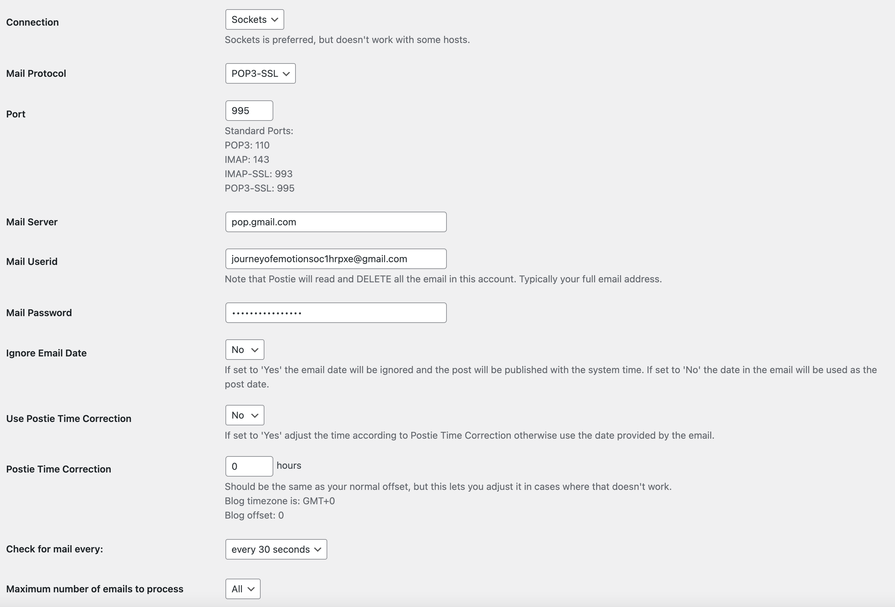

# Instructables setup Journey of emotion

Journey of emotion is een interactive installatie waar je een verhaal aan verteld en die via meerdere ai’s omzet naar abstracte kunst. Je kan dus je verhaal vertellen en Journey of emotion zal deze visualiseren.

Dit kan gebruikt worden voor mensen die emotionele verhalen hebben of last hebben van mentale problemen. Zo kunnen zij hun verhaal doen en wordt dit visueel zichtbaar voor iedereen. Zo kan men beter begrijpen hoe je een ander zich voelt omdat de gedachten in ons hoofd niet zichtbaar zijn en mensen deze dan ook moeilijker begrijpen.

## Benodigheden:

Materiaal:

- Lichte beamer
- Doos voor beamer die je op kan hangen
- Rilatine doosje
- Laptop
- Lange verlengkabels
- lange hdmi kabel
- Muziekbox
- Donkere ruimte

Tools:

- lasercutter

Software:

- Vs code
- Basic code knowledge
- Open ai api-key
- github

## Stap 1:

Je api-key opzetten in open ai -> credit card linken aan je open ai account

## Stap 2:

github code clonen in de terminal
github: https://github.com/Arne-vs/journeyofemotions/tree/main

## Stap 3:

Nu ga je in je terminal naar de map die je net hebt gecloned hier doe je `npm install`.

## Stap 4:

1: je installeerd op je wordpress site postie en maakt een postpage
2: je maakt een email die uniek is en niet makkelijk te vinden is
3: Je vult alles in zoals het hier staat met de email die je net hebt gemaakt

## Stap 5:

Api key in code zetten.
Je heb je openai api-key en deze zet je in de .env.example file achter OPENAI.
`OPENAI=`
Achter yourEmail zet je u email dat je standaard gebruikt.
`yourEmail=`
Achter PasswordEmail zet je het wachtwoord van u email.
`PasswordEmail=`
Acter emailToSendPost zet je je net gemaakte uniek email adres
`emailToSendPost=`

Dit zet je allemaal weer in de git ignore zodat je het geheim houd.

## Stap 6:

Nu staat alles op je laptop klaar

en moet je enkel `npm run dev` in je terminal doen en surfen naar `http://localhost:3000/`

## code uitleg

### index.js

hier alles wat je ziet geschreven dus al de visuals worden via hier getoont.
Dit is de hoofd pagina waar alles naartoe komt.

### whisper.js

in deze code word de stem opgenomen en omgezet naar text en geplaatst in het variable van transcript die geïmporteerd wordt in de answer.js

### answer.js + get-answer.js

Hier wordt de transcript omgezet via tex-davinci naar een prompt voor dall-e met de stijl abstracte kunst in het engels.
De stijl en de vraag staat er altijd bij hetzelfde zodat je het juiste resultaat krijgt.
Dit resultaat wordt als een variabele geïmporteerd in art.js

### art.js + get-painting.js

Hier wordt de prompt omgezet naar een afbeelding via text-to-image van dall-e en deze afbeelding wordt dan in de index opgevraagt en getoont.

### sendEmail.js

De gegenereerde afbeelding word hier gestuurd naar een email dat alles wat het aankrijgt post op mijn wordpress site.

## Stap 7:

Nu de code helemaal is geïnstalleerd kan je een doos voor de beamer maken.

Je download deze dfx file en lasercut hem.
Daarna lijm je de doos en zaag je gaten voor je ports van je beamer.

## Stap 8:

Om de beamer op de juiste kanteling te nemen neem je een rilatine doosje.
Deze rol je op en tape je vast als een soort cilinder met een hoogte van 2cm.
Dan plak je hem vast in het midden van de doos en op 3cm van de achterkant.

## Stap 9:

Nu je doos klaar is leg je je beamer in de doos.

Daarna steek je de hdmi kabel en de power adapter al in de beamer maar NIET in het stopcontact.

## Stap 10:

Je hangt de doos met de beamer in aan de plakaten die aan het plafont hangen op de achterste 2 plakaten gekeken vanuit de muur warop je gaat projecteren en hang je hem op die plakaten zo dicht mogelijk tegen de muur waarop je gaat projecteren.

## Stap 11:

Nu ga je via de muur met je verlengkabel tot op 1 van de plakaten en steek je de stekker van de beamer en de oplader van je laptop erin.

## Stap 12:

Je stelt je beamer in zodat hij recht op de muur projecteerd.

## Stap 13:

Je hangt een webcam of kleine microfoon aan je laptop en stelt in dat hij deze moet gebruiken als microfoon.

## Stap 14:

Je gaat naar de localhost:3000 en opent hem in full screen
Je legt nu je laptop op een ander plakaat en je connecteerd hem met de beamer via een hdmi kabel.
Je hangt de microfoon zodat hij op mond hoogte in de kamer hangt.

## Stap 15:

Alles staat nu kaar nu moet je enkel nog de ruimte voledig donker maken.
Dit kan met zilverpapier en water op de ramen. Je plakt alles af met het zilverpapier door eerst water op de plek waar je het zilverpapier te spuiten en dan je zilverpapier er op te drukken.

## Stap 16:

Je gaat nu nog op de deur een bordje hangen dat aangeeft of de ruimte vrij is of bezet zodat men apart binnen gaat en niet gestoord word

## Stap 17:

Als laatste ga je een box met bluethoot aanzetten en verbinden met je gsm of ipad en je zet lofi muziek zonder text op die heel rustgevend is.

Nu staat alles klaar en kan je start zeggen in de microfoon en je verhaal vertellen.
